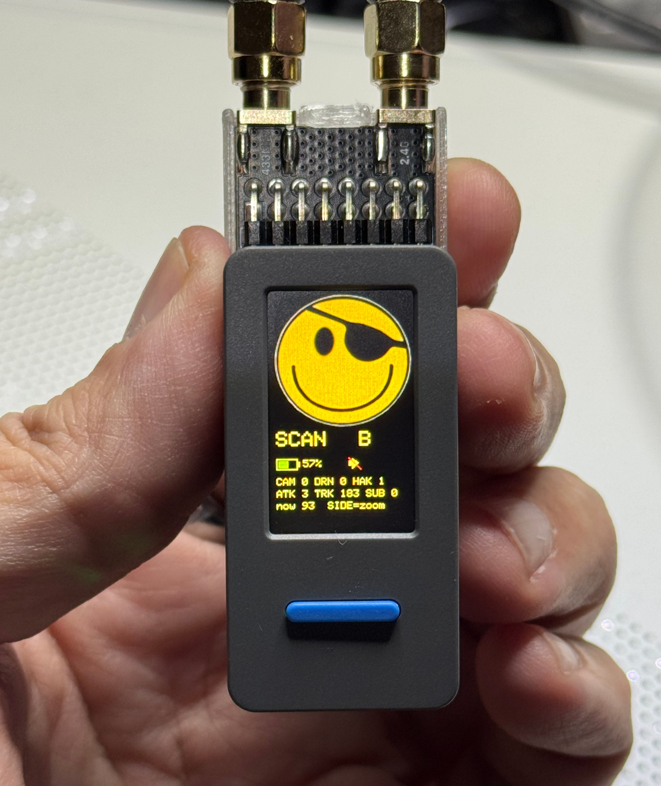
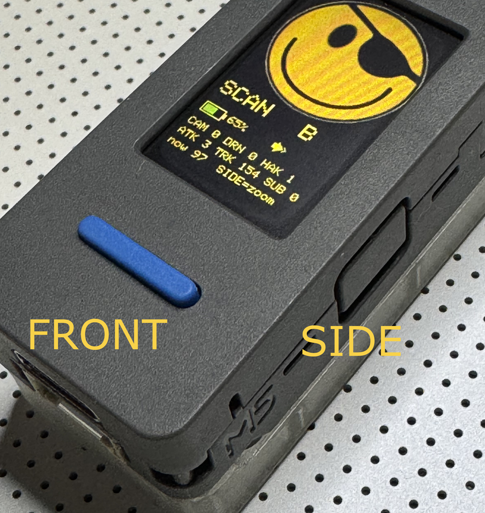
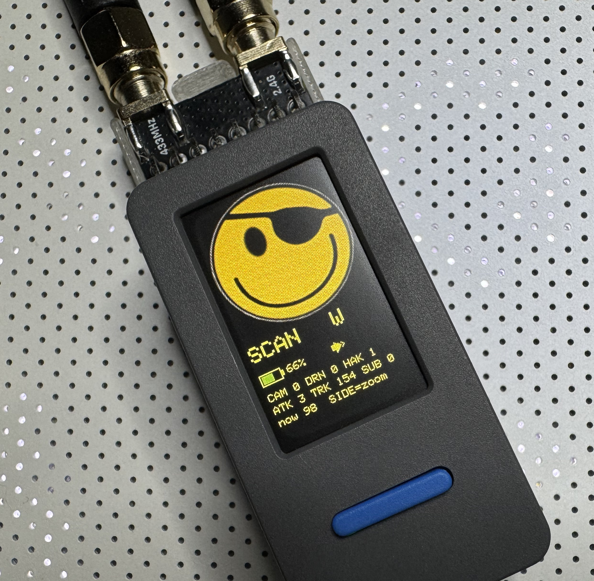
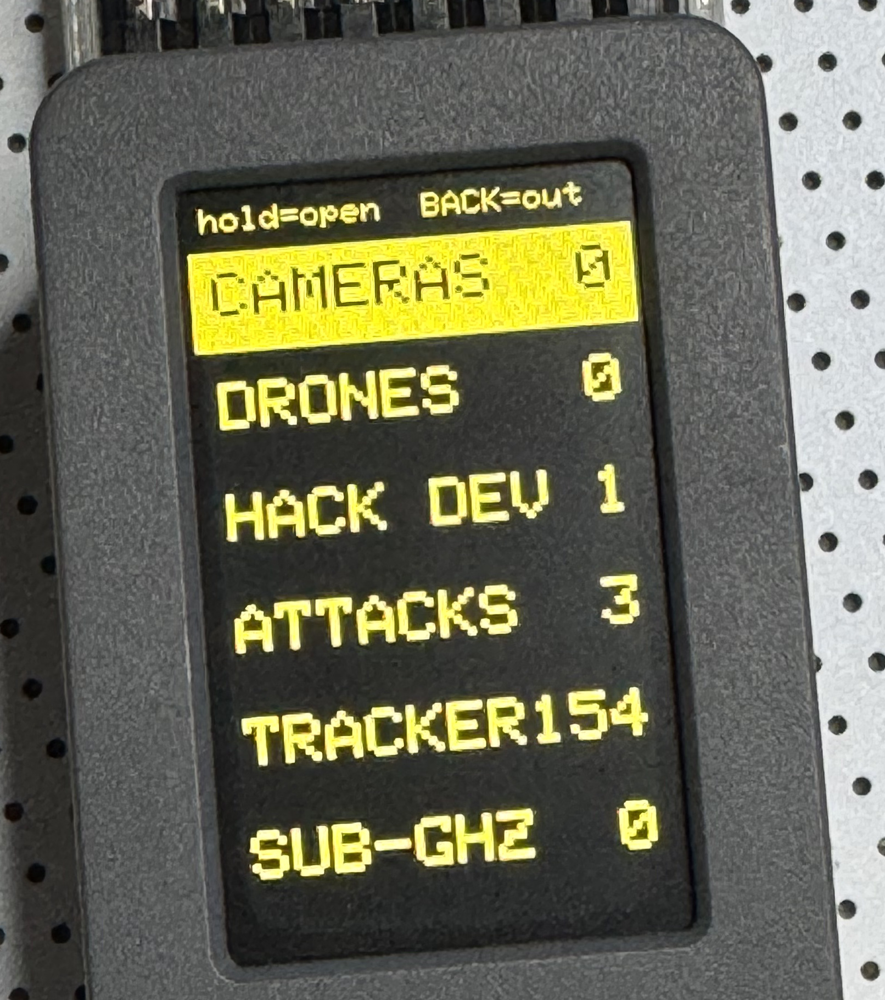

<p align="center">
  
</p>

# FUD Firmware

**Find Unwelcome Devices.** (And, yes, the other kind of FUD. Both are the
point.)

A wearable surveillance-awareness device. FUD Firmware runs on an M5Stack
StickS3 with a Pingequa RF Pack S3, and Zuse (its onboard mascot) watches the
airwaves around you for cameras, trackers, and active wireless attacks. Wear it
or clip it to a bag. Zuse is passive by design: no recording, no storage, no
social features. He will not replace your primary security devices, but he can
give you a clue that it is time to deploy them.

FUD was designed to work with the Pingequa RF Pack S3 for the M5Stack StickS3.
The RF Pack is optional. On a bare StickS3 the WiFi and Bluetooth scanners still
run; Zuse simply switches the sub-GHz and 2.4 GHz scanners off when no pack is
detected.

## What FUD is (and is not)

FUD is a first line of defense. A canary in the coal mine. When Zuse trips, that
is your clue to bring out bigger tools or to shut down whatever devices of yours
are under attack. He does not give you a full forensic breakdown of every
alarm, and he is not meant to. Within the limits of a tiny screen, two buttons,
and a small battery, Zuse aims to catch anything alarming he reasonably can, and
to be at least as capable as other small detectors built for this class of
hardware.

When Zuse flags something and you want to dig deeper, tools worth reaching
for include SquachWatch-CYD (a larger-screen surveillance detector), Bruce
firmware (a full pentest toolkit), a Flipper Zero (sub-GHz, NFC, IR), and, for
real WiFi forensics, a laptop running Kismet, Wireshark, or the aircrack-ng
tools. Some things are simply beyond this hardware, and FUD will not pretend
otherwise.

FUD has no offensive features. Period. No spamming, deauth, prank WiFi APs, or
rickrolls. It is for detection and information only. Skids are welcome to use
it all day and learn. If you want attacks, look at Bruce or Nemo or other fine
firmware options.

## Meet Zuse
<p align="center">
  
</p>
Zuse (named for Konrad Zuse, and a character played by Michael Sheen in 2010)
is the friendly face watching out for you. He loves to share FUD with you.

## What Zuse looks for

- **Cameras and surveillance:** Flock Safety ALPR, Axon body cameras, Ray-Ban
  Meta and other camera glasses, and camera-vendor gear by hardware address
  (Nest, Arlo, Tesla).
- **Trackers:** Apple AirTag and Find My, Tile, Samsung SmartTag, Google Find
  My Device. Logged silently, with a stuck-with-you timer.
- **Drones:** Remote ID broadcasts (presence).
- **Hacker devices:** Flipper Zero, WiFi Pineapple, and the `pwned` beacon.
- **Active attacks:** WiFi deauthentication floods, evil-twin access points, and
  a 2.4 GHz broadband jammer.
- **Sub-GHz:** activity on the 433 MHz band (key fobs, remotes, replays), with
  the RF Pack.

Each match carries a High, Medium, or Low confidence grade (see Alerts). The
signature facts (service UUIDs, company IDs, OUI prefixes) are public registry
data, and the detection categories are shared with the SquachWatch-CYD project.

## How Zuse scans (operating procedure)

FUD is not a radar detector or a just-in-time alarm. Zuse does not try to catch
every packet the instant it appears. Instead he works in a rotation: each radio
mode gets the antenna to itself for a window of several seconds, then he hands
off to the next mode.

A full cycle today is roughly:

1. Bluetooth LE for about 6 seconds
2. WiFi network scan
3. WiFi attack monitor (deauth and disassoc) for about 5 seconds

With the RF Pack present, two more phases join the rotation:

4. Sub-GHz activity on 433 MHz (CC1101). Flags nearby sub-GHz transmissions:
   key fobs, tire sensors, remotes, and anyone transmitting or replaying on the
   band. Informational, logged.
5. A 2.4 GHz sweep (nRF24) that watches for a broadband jammer lighting up the
   whole band at once, which is treated as an active attack.

This means that while one mode is listening, the others are briefly deaf. A
signal can slip past for a cycle or so before it lands in a window that hears
it. That tradeoff is on purpose. It is much easier on the small battery and
plenty fast for something you carry while traveling. Windows are long enough
to recognize a pattern (a burst of deauth frames, a tracker that keeps
showing up), which matters more than never missing a single frame.

## Controls
<p align="center">
  
</p>
Two buttons give four actions, plus a tap. The rule is the same almost
everywhere: **Front tap = next, Front hold = select, Side tap = back, Side hold
= home** (return to scanning).

- **Home:** Front tap opens the log (or, if an alert is up, opens the alert to
  inspect it). Front hold mutes. Side tap goes to the Status screen. Side hold
  opens the zoomed, large-text category view.
- **Status screen:** battery, mute, whether the RF Pack is present, and a menu
  (Log, Toys, Settings, Clear cache). Front tap moves, Front hold opens. Side
  hold here runs Snooze All. (See below for an explanation of that.)
- **Lists and menus:** Front tap scrolls, Front hold opens/confirms, Side tap
  backs out.
- **Detail screens with nothing to select:** Front hold zooms the text large
  and scrolls it; a Front tap returns.
- **Double-tap the body:** acknowledge and clear the current alert.
- **Both buttons held ten seconds:** hard reset. Clears the detection log and
  counters; your saved Ignore list and mute setting are kept.
- **Left Button** ESP32 control. This button is not touched in FUD firmware and
  is reserved for reboots, power, and firmware settings. Check M5Stick S3 docs.

<p align="center">
  
  
</p>

The little letter next to SCAN on the home screen is the radio Zuse has on the
antenna this moment: B for Bluetooth, W for WiFi, S for sub-GHz, N for the
2.4 GHz sweep.

Zuse remembers mute, volume, and the alert filter across reboots. Brightness is
also adjustable but resets to normal on reboot, so a too-dim screen can never
lock you out.

Mute and Snooze All are different on purpose.

- On Mute, Zuse ignores everything: he stays silent and calm no matter what is
  around, while still detecting and logging in the background, until you unmute.
- Snooze All baselines where you are right now. Everything already detected is
  marked known and Zuse stops alerting on it, but a genuinely new device still
  gets through. This is for the crowded bus where fifty trackers are already
  along for the ride and you only care about the next one.

## What the faces mean

Zuse is the mascot. His face reflects what is going on.

- Smiley: idle, all clear.
- Angry red face: a hacking device or attack is nearby.
- Lord Nikon's lens: a camera or surveillance device.
- Zero Cool's Skull: an active attack in progress.
- Acid Burn's Flame: a hacking tool is present.
- Sad: low battery.
- Playful expressions in between: because Zuse likes you.

## Alerts

Threats are tiered.

- For an active attack (like a deauth flood) Zuse sounds off and throws up the
  hacker screen. He repeats about every 15 seconds until you acknowledge it,
  then goes quiet with only an occasional silent reminder while the attacker is
  still around.
- Cameras and hacking devices (like Flippers) get one beep, then Zuse logs them.
- Trackers (AirTag, Tile, and similar) Zuse logs silently in their own section,
  with a timer for how long one has been near you. A tracker that stays with you
  for a long time is the one worth worrying about.

Every detection carries a confidence grade, shown on its detail screen as
`conf H`, `conf M`, or `conf L`: High is a vendor-registered signature, Medium
is a good but shareable one, Low is a generic or easily spoofed match. The
**Alert Filter** in Settings (ALL, MED, or HIGH) is a minimum-confidence gate:
anything below it is still counted and logged, it just does not take over the
screen or make a sound. Set it to HIGH in a noisy place to keep only the solid
hits loud; leave it at ALL to hear everything.

Acknowledged items leave the active log so it stays uncluttered. The log is
held in memory only, so a reset or power cycle clears it.

An item you Ignore is remembered across reboots, so a device you never want to
hear about again stays quiet for good. For WiFi, Ignore works by network name,
so a badly configured access point at home that looks like an evil twin goes
quiet across all of its radios at once, not one at a time.

## Settings

Reached from Status > Settings. Each row changes on Front hold.

- **Brightness:** HIGH, MED, LOW, DIM. Resets to HIGH on reboot.
- **Volume:** MAX, LOUD, MED, LOW, MIN, MUTE. Holding steps down (louder to
  quieter) and wraps from MUTE back to MAX, beeping a preview at each level.
  MED is the default. Remembered across reboots. (This is the loudness of the
  device's own sounds. It is separate from Mute, which silences alerts entirely
  while still logging.)
- **Alert Filter:** ALL, MED, HIGH. The minimum-confidence gate described above.
- **End of Line:** A tribute. Hold again to stop.

## Toys

Reached from Status > Toys. These are on-demand instruments, not part of the
background scan. Opening one pauses scanning while you use it; Side tap backs out
to the Toys menu.

- **Waterfall:** a live scrolling spectrum. Front tap switches band between the
  2.4 GHz sweep (nRF24) and the 433 MHz sub-GHz band (CC1101). Needs the RF Pack.
- **SSID Scan:** the WiFi networks around you, strongest first, with channel,
  signal, and an O for open networks. Refreshes every few seconds.
- **Traffic:** a rolling graph of how busy the 2.4 GHz band is, green to red,
  with a running peak. Needs the RF Pack.
- **TV-B-Gone:** points the built-in IR at a TV and blasts a set of power codes
  for the common brands (Samsung, LG, Sony, Vizio, TCL, Toshiba, Panasonic,
  Philips). Front fires; Side stops. The one sanctioned transmit in the whole
  device. It is a curated code set, not an exhaustive one, so an odd set may not
  respond.
- **Finder:** walk toward a signal. It lists the recent trackers, cameras, and
  hacker devices seen in the last five minutes; pick one and Front hold to lock
  onto it. The lock screen shows a live signal meter, a distance word (from
  RIGHT HERE down to FAINT), and whether you are getting HOTTER or COLDER as you
  move. Front resets the trend, Side goes back to the list. You can also jump
  straight here from the log: open any trackable entry and choose Find. Note
  that AirTags rotate their Bluetooth address every few minutes, so a locked
  AirTag can drop to "signal lost" and you simply pick it again.

## Build and flash

FUD is a PlatformIO project. With the StickS3 connected over USB-C:

```
pio run            # build
pio run -t upload  # build and flash
pio device monitor # serial log (115200)
```

The target is the `sticks3` environment in `platformio.ini`. First build pulls
M5Unified, NimBLE-Arduino (2.x), and IRremoteESP8266, and a pre-build step
embeds the face images. The RF Pack is optional; the same binary runs on a bare
StickS3 with the sub-GHz and 2.4 GHz scanners disabled.

Put your own devices in `src/user_ignore.h` so Zuse never alerts on them.

## Battery and display

The home screen shows the battery level, with a plus sign while charging. The
screen runs at normal brightness for fifteen seconds, then goes dark to save
power. Pick it up, rotate it, or press a button to wake it. When a threat
appears while the screen is dark, Zuse lights it for about five seconds to catch
your eye, then lets it go dark again, so he gets your attention without drawing
everyone else's.

## Attributions and thanks

This was written heavily inspired by
[SquachWatch-CYD](https://github.com/skizzophrenic/SquachWatch-CYD), who taught
me that it was fun to have a wide-device scanner with a little bit of
personality. That project has more than a little personality. It has personality
dripping out of every pixel. [Pingequa](https://www.pingequa.com/) made the
M5Stick S3 into a more powerful scanning device.
[Bruce Firmware](https://bruce.computer/) and others showed what is capable on a
wee little machine, and as of this writing is the only other firmware tailored to
the Pingequa RF Pack S3. Finally, thanks to
[OUI-SPY](https://github.com/colonelpanichacks/oui-spy) for inspiring wearable
scan and alert devices.

A few more that shaped FUD: [m5stick-nemo](https://github.com/n0xa/m5stick-nemo)
for the TV-B-Gone approach on M5Stick hardware,
[Pwnagotchi](https://github.com/evilsocket/pwnagotchi) for the idea of a little
machine with moods, [M5PORKCHOP](https://github.com/0ct0sec/M5PORKCHOP) for
treating activity as personality, and
[Flipper Zero](https://github.com/flipperdevices/flipperzero-firmware) for
setting the bar on what a pocket radio tool can be.

FUD stands on open hardware and open libraries: [M5Stack](https://m5stack.com/)'s
M5Unified and M5GFX, [NimBLE-Arduino](https://github.com/h2zero/NimBLE-Arduino)
by h2zero, [IRremoteESP8266](https://github.com/crankyoldgit/IRremoteESP8266) by
crankyoldgit, and [PlatformIO](https://platformio.org/) with the Espressif
Arduino core.

Two specifics worth naming plainly. While it is not the exclusive source of
unwanted device identifiers, this code contains a subset of Talking Sasquach's
[signature collection](https://github.com/thoughtfix/SquachWatch-CYD/blob/master/src/signatures.cpp)
and confidence grades, and we have adopted his chosen GPLv3 license to uphold
that credit. And the TV-B-Gone toy is a tribute to the original by Mitch Altman
and Cornfield Electronics; the IR power codes are public values sent through
IRremoteESP8266, and the approach on M5Stick hardware follows m5stick-nemo.

The signatures are public facts, not guesses, and were cross-checked against the
bodies that publish them: the
[IEEE Registration Authority](https://standards-oui.ieee.org/) OUI and MA-L
registries, the
[Bluetooth SIG assigned numbers](https://www.bluetooth.com/specifications/assigned-numbers/)
(company IDs and GATT service UUIDs), the
[ASTM F3411 / Open Drone ID](https://github.com/opendroneid/opendroneid-core-c)
Remote ID format, and the [FCC ID database](https://www.fcc.gov/oet/ea/fccid) for
working out what a given radio actually is.

I encourage anyone to send stars to the projects and tools linked above:

- https://github.com/skizzophrenic/SquachWatch-CYD
- https://github.com/BruceDevices/firmware
- https://github.com/colonelpanichacks/oui-spy
- https://github.com/n0xa/m5stick-nemo
- https://github.com/evilsocket/pwnagotchi
- https://github.com/0ct0sec/M5PORKCHOP
- https://github.com/flipperdevices/flipperzero-firmware
- https://github.com/h2zero/NimBLE-Arduino
- https://github.com/crankyoldgit/IRremoteESP8266
- https://github.com/opendroneid/opendroneid-core-c

And ten billion thanks to all the wardrivers and data harvesters, including the
volunteers behind [WiGLE](https://wigle.net/), who collect the OUIs and MAC
addresses and other data used to help power counter-surveillance.

## License

FUD is released under the [GNU General Public License v3.0](LICENSE), the same
license as SquachWatch-CYD, whose signature data this project builds on. In
short: use it, study it, change it, share it, but keep derivatives open under
the same terms.
